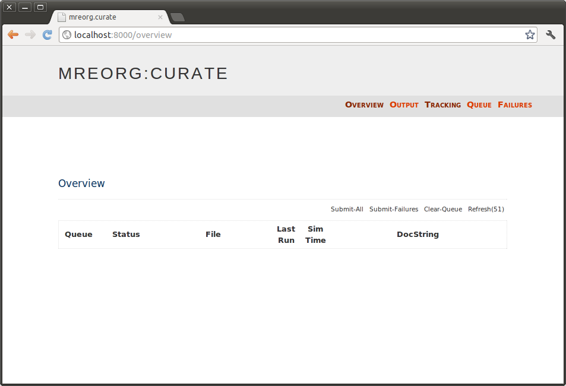
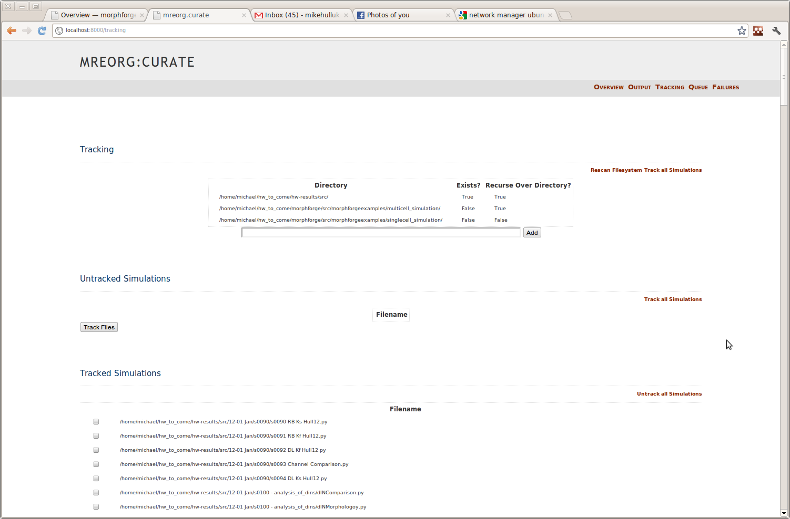
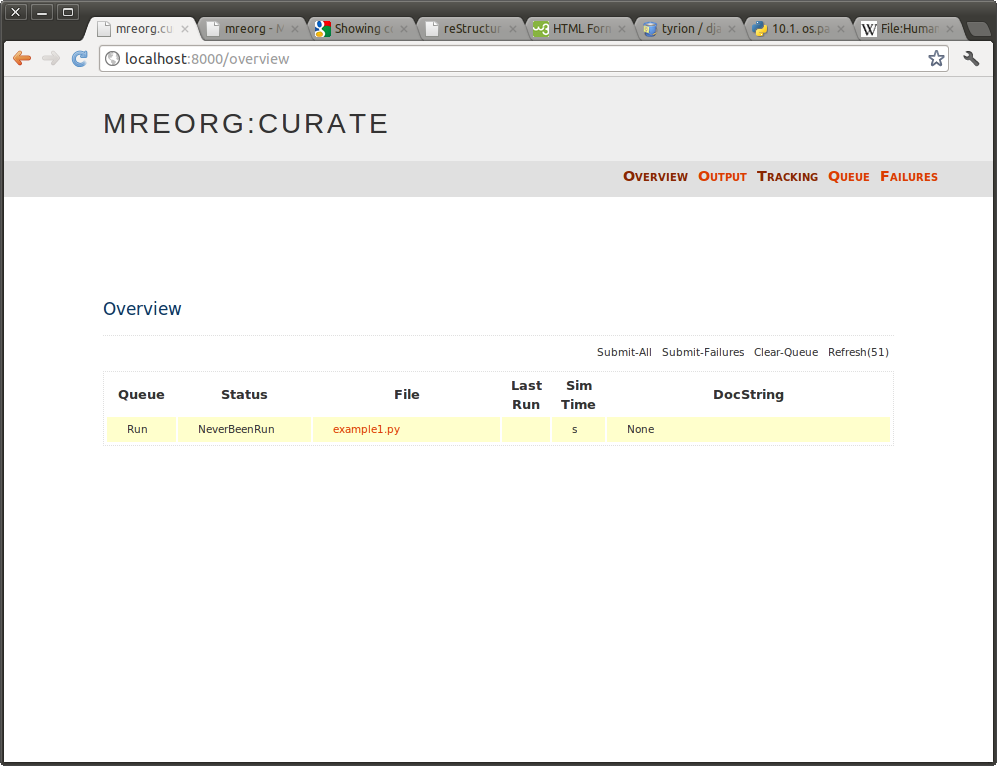
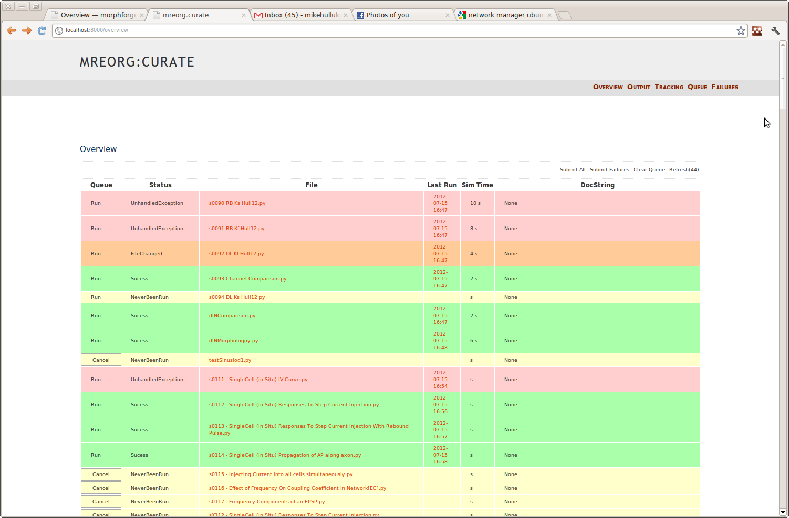
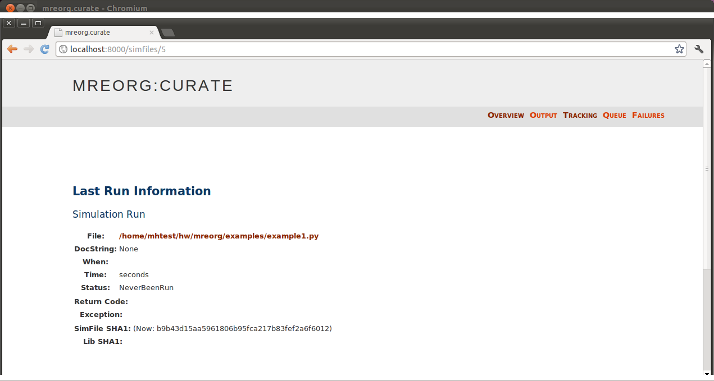
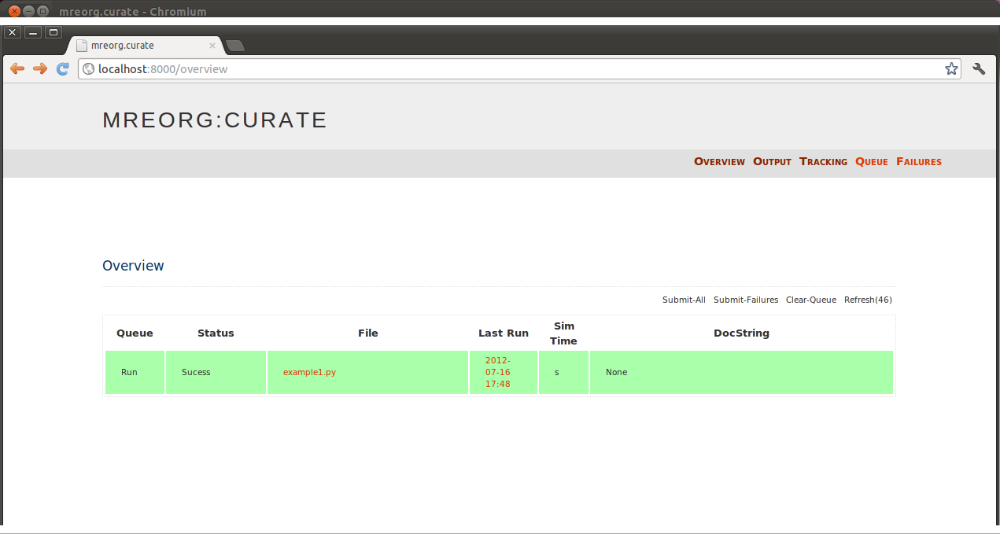
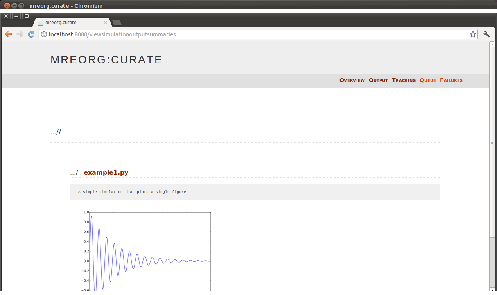
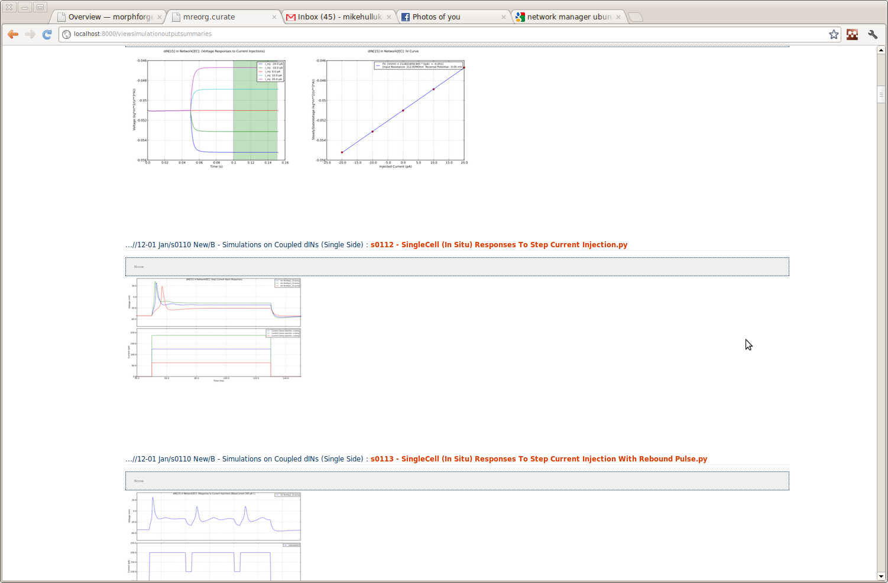

.. |mreorg| replace:: *mreorg*
.. |mreorg.curate| replace:: *mreorg.curate*

Managing Workflows in Python
============================

.. contents::
   

Overview
---------

Python is a widely used language in computational sciences for modelling 
and data analysis; however, with large amounts of data, scripts can 
quickly become unwiedly. |mreorg| is a library containing functions and
tools to manage large numbers of scripts and thier output. It was written
by Mike Hull as part of his Ph. D, to help manage scripts used in building
models in computational neuroscience. It is designed to be as non-invasive 
to scripts as possible. An  ``import mreorg`` statement is generally all that
needs to be added to a script.

Main features:
  
  * Works with matplotlib to:
     - automatically save all plots at the end of a script (no more calls to pylab.save_figure)
     - configure behaviour of ``show()`` using environmental variables,
       so the same script can be used to generate graphs on screen, or just save 
       them to a file, without changing the contents of the file.
  
  * A stand-alone application |mreorg.curate|, for managing collections of 
    scripts. 
      - web interface to launch scripts and visualise output as html
      - Scripts can be queued and run sequentially

Installation
------------

.. note::

	(mreorg has only been tested on Linux; it should work on mac with some
	adjustment; if you are simulating with python on windows you may have 
	larger problems than what |mreorg| can help you with :)  )

To install |mreorg| locally (in the home directory):

 1. Clone the git repository::

	$ cd ~
	$ git clone git://github.com/mikehulluk/mreorg.git

 2. Add |mreorg| binaries and python files to shell-paths, by editing
    login scripts (normally `~/.bashrc`). Add the following lines
    to the end of this file::
	
	export PYTHONPATH='$PYTHONPATH:/home/YOURUSERNAME/mreorg/src/'
	export PATH='$PATH:/home/YOURUSERNAME/mreorg/bin/'

 3. Re-run your login script to take effect (or logout then log back in)::
	
	source ~/.bashrc
	
 4. |mreorg.curate| uses the `django` framework and `dajaxice` for displaying the webpages.
    On Ubuntu (12.4), these can be installed with::

	 $ sudo apt-get install python-django python-django-dajaxice.

Scripting with |mreorg|
------------------------

|mreorg| controls what happens to figures generated using matplotlib. Depending
on the context in which it is being used; a user may want the results of a
simulation script to be displayed on the screen when it is launched from the
commandline, but may want to save figures to files when the script is being
called as part of a larger batch. |mreorg| allows this behaviour to be
controlled through environmental variables and an import statement at the top
of the script. 

For example, the following script (`mreorg/examples/examples1.py`) generates a simple figure in maptlotlib. 

.. literalinclude:: /example_links/example1.py

Without any environmental variables set, |mreorg| will not change any behaviour
and the figure will pop up on the screen as normal::
	
	$ python example1.py
	< Figure window opens >
	$

By *exporting* different environmental variable options, we can change this
behaviour::

	$ export MREORG_NOSHOW='' 
	$ python example1.py
	<- No figure window opens ->
	$ unset MREORG_NOSHOW

	$ export MREORG_SAVEALL=''
	$ python example1.py
	Saving File _output/figures/example1/eps/fig000_Autosave_figure_1.eps
	Saving File _output/figures/example1/pdf/fig000_Autosave_figure_1.pdf
	Saving File _output/figures/example1/png/fig000_Autosave_figure_1.png
	Saving File _output/figures/example1/svg/fig000_Autosave_figure_1.svg
	<- Figure window opens ->
	$ unset MREORG_SAVEALL

	$ export MREORG_SAVEALL=''
	$ export MREORG_NOSHOW='' 
	$ python example1.py
	Saving File _output/figures/example1/eps/fig000_Autosave_figure_1.eps
	Saving File _output/figures/example1/pdf/fig000_Autosave_figure_1.pdf
	Saving File _output/figures/example1/png/fig000_Autosave_figure_1.png
	Saving File _output/figures/example1/svg/fig000_Autosave_figure_1.svg
	<- No figure window opens ->
	$

By default, figures are saved into a folder `_output/figures/{scriptname}/{figtype}/{figname}` within the folder containing the scripts, even if the script is called from another directory.

Environmental variables are read once when then :py:mod:`mreorg` module is initially loaded. These options can be changed within the script by setting attributes on the :py:class:`~mreorg.ScriptFlags`. The monkey-patching of matplotlib can be seen in :py:mod:`mreorg.requiredpreimport` and the handling of matplotlib figures is managed by :py:class:`~mreorg.PlotManager`

.. code-block:: python
	
	import mreorg
	mreorg.ScriptFlags.MREORG_NOSHOW = True
	mreorg.ScriptFlags.MREORG_SAVALL = False
	mreorg.PlotManager.XXYYXX # set the figure types.
	...

Managing Simulations with |mreorg.curate|
-------------------------------------------

Over the course of my PhD, I found I had hundreds of simulation scripts written in python, which took different lengths of time to run, and produced lots of matplotlib graphs. I often wanted to browse through the output of these simulations, and since there was often dependancies between files; when I made changes, I wanted to know whether they had sucessfully run since the last change. I started with a system of makefiles, which slowly developed into a more user-friendly |mreorg.curate|, which I hope can be of use to other people.

If you are using a single simulator-program, and changing the values of commandline options you pass to it; then Andrew Davison's `Sumatra package <http://packages.python.org/Sumatra/>`_ might be a more appropriate option.

Fundementally, |mreorg.curate| is a database which tracks simulation files, can launch them, capture there output, and display everything through a webpage. This makes it easier to keep on top of files; and also to refactor internal libraries more confidently, since it is easy to ensure that 'everything is up to date'.

|mreorg.curate| consists of a commandline tool and web-interface. It uses an SQL-lite database to store its settings.

1. Setting up *~/mreorgrc*
~~~~~~~~~~~~~~~~~~~~~~~~~~~

*(This is optional and covered in more detail below)*

2. Creating a database 
~~~~~~~~~~~~~~~~~~~~~~~

We first need to initialise an empty datadase, by running the command::

	$ mreorg.curate builddb

If the database already exists, but you want to clear it out and start again, use
the `--rebuild` flag::
	
	$ mreorg.curate builddb --rebuild

This will wipe all existing results. By default the database is stored in `~/.mreorg/mreorg.sqlite`

3. Launch the front-end
~~~~~~~~~~~~~~~~~~~~~~~

Launch the webserver with the command::
	
	$ mreorg.curate runserver

By default |mreorg.curate| listens on `8000`. Open a web browser and navigate
to `localhost:8000` . (If the |mreorg.curate| webserver crashes and blocks the
port, you can relaunch on another port with  `mreorg.curate -p 8001`). You
should be greeted with an overview window as shown.

Every page has 5 navigation buttons on the right hand side (Overview, Output,
Tracking, Queue, Failures). The start page is the 'Overview' page - this will
contain a list of the simulations that are being tracked, and their current
states. At the moment, no simulations are being tracked so the list is empty.

4. Track some Simulations
~~~~~~~~~~~~~~~~~~~~~~~~~

To use simulations, they need to be **tracked** by |mreorg.curate|. To do this, we first
specify a set of 'Monitored Directories', which are directories that |mreorg.curate| is
going to look for files to track.

Click the `Tracking` link in the top-right corner. This will bring you
to a window similar to that shown:

In the section 'Monitored Directories', add the path of the directory where
your simulation files are, and click add.  This will add a new entry in the
table. Check that the directory exists (*Exists* column), and click on the
*Rescan Filesystem* button. (With lots of directories, rescaning the
file-system can get quite slow, especially with recursive monitoring, so it is
a manual command for now. If someone can improve this, that would be great)

This should populate the list of *Untracked Simulations* with all the .py files
found in the monitored directories. In this case, we want to track `example1.py` 
so select the tickbox, and click **Track Files** directly underneath. 

5. Queue up the Simulation
~~~~~~~~~~~~~~~~~~~~~~~~~~

Now we have set up simulation tracking, we return to the **Overview** page, which should 
now look as follows:
 

The overview page contains a single table, one row for each simulation. The colour of each row represents the 
current state of the simulation (also written in the status column)

  * Yellow: There are no results from running this simulation; either it has never been run, or it never calls `import mreorg` .
  * Green: On the last submission, the simulation ran fine, and the file has not changed since then. (Note dependancies are **not** checked)
  * Orange: The simulation has changed since the last run. 
  * Red: The last run of the simulation failed.

In this case; we have only tracked a single simulation, and it has not yet run, so we see a single row in yellow. However, the following screen shot shows a database tracking many simulations, in which the simulations are in different states:

In the table, clicking on the link for a simulation in the **File** column will bring up more information about the file. Clicking on the link  in the **Last-Run** (shown as a date) will provide you with more information about that particular run; for example:

This page provides information for example about any exceptions thrown. From this pages it is possible to drop straight into an editor and terminal window by clicking on the hyperlink to the right of **File**. This editor can  be customised in *~/.mreorgrc* .

Returning to the *Overview* page; |mreorg.curate| implements a simple queue system for running simulations. Simulations can be added to the queue by clicking on **Run** in the first column of the row. When this happens, the text should change to **Cancel** and horizontal bars should appear in the box, to say the simulation is queued. Clicking this again will remove the simulations from the queue (unless they have already started). You can select multiple simulations to be queued.

6. Launch the backend
~~~~~~~~~~~~~~~~~~~~~

Although we have selected our simulation to run, currently nothing will happen;
we need to create some *backend-workers* to actually run the simulations.

Returning to the command terminal, we create a process that will actually run the simulations::

	$ mreorg.curate runbackend
	
This starts a process that will continually check for new simulations to be
added to the queue. If it finds one, then it will execute it; update the
database with the results; then look for another one; and so forth. It is
possible to run many *backends* in parallel in different terminals; (they are
smart enough not to run the same simulation). You can cancel a worker with
`Ctrl-C`. 

By default, a script that takes longer than 1800 secs (30 mins) will raise a
*TimeOutException*. (I will make this configurable at some point).

When you run this command, the result should be a sucess, and after a short
while, the yellow row on the overview page on the webpage should turn green
automatically. (By default, the 'Overview-Page' updates every 60 seconds, but it
is possible to force an update by reloading the entire page.)

7. Visualise the output
~~~~~~~~~~~~~~~~~~~~~~~

Now that the script has run; we want to see the output. One option is through
the **Last-Run** link, but it is often more convieniant to see the output of
all the simulations. This is available on the **Output** page. You should see
something like:

The following shows the output from multiple simulation scripts. 

Configuration
------------------

Environmental Variable
~~~~~~~~~~~~~~~~~~~~~~~

|mreorg| recognises the following environmental variables. Thier contents is ignored, 
it is only important if they are set or not.

============================= =====================================================
Environmental variable name   Effect
============================= =====================================================
MREORG_NOSHOW		      Prevents windows from being shown when pylab.show()
			      or matplotlib.show() are called.
----------------------------- -----------------------------------------------------
MREORG_SAVEALL		      Automatically save figures when .show() is called,
                              or the end of the script is reached.
----------------------------- -----------------------------------------------------
MREORG_BATCHRUN		      Sets both `MREORG_NOSHOW` and `MREORG_SAVEALL`
----------------------------- -----------------------------------------------------
MREORG_CURATIONRUN            Sets both `MREORG_NOSHOW` and `MREORG_SAVEALL` (and
			      also records the results of this simulation in the
                              |mreorg.curate| database)
============================= =====================================================

.. note::

	In Linux, environmental variables can be set by::
		
		$ export MREORG_XYZ=''
	
	and unset by::
		
		$ unset MREORG_XYZ

	You can see all the environmental variables using::
		
		$ env
		# or
		$ env | grep 'MREOG_XYZ'

	In `make` files, you need to be a bit careful, either using a one-liner::

		$ cat Makefile
		example1.py.out: example1.py
			export 'MREORG_XYZ'; python example1.py > example1.py.out
		$

	Or exporting it globally::

		$ cat Makefile
		MREORG_XYZ=
		example1.py.out: example1.py
			python example1.py > example1.py.out
		$

		

*~/.mreorgrc*
~~~~~~~~~~~~~

|mreorg| can be customised using a *~/.mreorgrc* file. An example is given here (from `mreorg/etc_sample/.mreorgrc`).

.. literalinclude:: etc_links/.mreorgrc
   :language: python

Contact Information
--------------------
 
 * Email me: ?ike?ulluk@googlemail.com where ?s can be found at the top of the page!
 * GitHub: https://github.com/mikehulluk/mreorg

